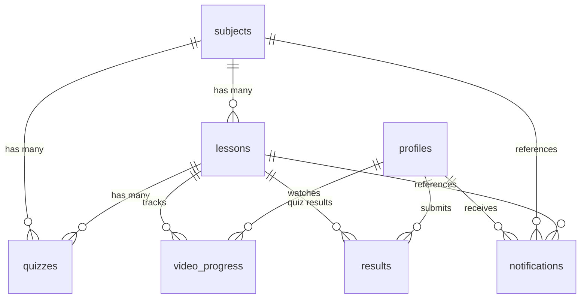

# 📘 Nexora Academy — Developer Documentation

> **Version**: 1.0 · **Stack**: Flutter + Supabase + Riverpod · **Architecture**: Feature-first Clean Architecture

---

## Table of Contents

1. [Architecture Overview](#1--architecture-overview-)
2. [Folder Structure](#2--folder-structure-)
3. [Core Features Breakdown](#3--core-features-breakdown-)
4. [Database Structure](#4--database-structure-)
5. [Key Global Files](#5--key-global-files-)
6. [Data Flow Example](#6--data-flow-example-)
7. [Performance & Best Practices](#7--performance--best-practices-)
8. [Developer Guidelines](#8--developer-guidelines-)

---

## 1. 🏛️ Architecture Overview

Nexora Academy follows a **feature-first Clean Architecture** pattern. Each feature is self-contained with its own data, domain, and presentation layers.

### Data Flow

```
┌──────────────┐     ┌──────────────┐     ┌──────────────┐     ┌──────────────┐
│     UI       │ ──▶ │   Provider   │ ──▶ │  Repository  │ ──▶ │   Supabase   │
│  (Widgets)   │ ◀── │  (Riverpod)  │ ◀── │  (Data Layer)│ ◀── │  (Backend)   │
└──────────────┘     └──────────────┘     └──────────────┘     └──────────────┘
```

### Layer Responsibilities

| Layer | Responsibility |
|---|---|
| **UI (Presentation)** | Renders widgets. Watches providers. Zero business logic. |
| **Provider** | Riverpod providers that expose data to the UI. Handles async state (`AsyncValue`). |
| **Repository** | Business logic layer. Calls Supabase API, handles caching (Hive), offline fallback, and data transformation. |
| **Domain (Models)** | Pure Dart classes. `fromJson` / `toJson` serialization. No framework dependencies. |
| **Supabase** | Backend: PostgreSQL database, Auth, Storage, Realtime subscriptions, and Edge Functions (RPC). |

---

## 2. 📂 Folder Structure

```
lib/
├── main.dart                          # App entry point (Supabase + Hive init)
│
├── core/                              # Shared utilities
│   ├── constants/                     # App-wide constants
│   ├── providers/                     # Global providers
│   │   ├── appbar_provider.dart       # AppBar state management
│   │   ├── connectivity_provider.dart # Online/offline detection
│   │   └── fullscreen_provider.dart   # YouTube fullscreen toggle
│   ├── router/
│   │   └── app_router.dart            # GoRouter config with guards
│   ├── theme/                         # Material 3 theme data
│   ├── utils/                         # Helper utilities
│   └── widgets/                       # Reusable UI components
│       ├── animated_counter.dart      # TweenAnimationBuilder counter
│       ├── empty_state_widget.dart    # Icon + message empty state
│       ├── shimmer_loaders.dart       # Skeleton loading (grid / list / chart)
│       ├── smart_math_view.dart       # LaTeX math renderer
│       └── tap_scale_wrapper.dart     # Press-down scale animation
│
└── features/                          # Feature modules
    ├── admin/                         # Admin panel
    │   ├── data/
    │   │   ├── admin_analytics_service.dart
    │   │   ├── admin_providers.dart
    │   │   ├── admin_repository.dart
    │   │   └── realtime_repository.dart
    │   ├── domain/
    │   │   ├── admin_analytics_model.dart
    │   │   ├── admin_quiz_summary_model.dart
    │   │   └── live_activity_model.dart
    │   └── presentation/
    │       ├── providers/
    │       ├── screens/               # Dashboard, Add/Manage screens
    │       └── widgets/               # Live activity, charts, math editor
    │
    ├── authentication/                # Auth (login / register)
    │   ├── data/
    │   │   └── supabase_auth_repository.dart
    │   ├── domain/
    │   │   └── auth_repository.dart   # Abstract interface
    │   └── presentation/
    │       ├── controllers/
    │       │   └── auth_controller.dart
    │       └── screens/               # LoginScreen, RegisterScreen
    │
    ├── courses/                       # Subjects & Lessons
    │   ├── data/
    │   │   ├── courses_repository.dart   # Supabase + Hive offline cache
    │   │   ├── progress_repository.dart  # Subject progress tracking
    │   │   └── storage_repository.dart   # Supabase Storage (PDFs/videos)
    │   ├── domain/models/
    │   │   ├── subject_model.dart
    │   │   ├── lesson_model.dart
    │   │   └── user_progress_model.dart
    │   └── presentation/
    │       ├── providers/
    │       │   ├── courses_provider.dart
    │       │   ├── lesson_details_provider.dart
    │       │   └── storage_provider.dart
    │       ├── screens/               # Subjects, Lessons, LessonDetails, PDF
    │       └── widgets/               # Subject cards, video players
    │
    ├── dashboard/                     # Home dashboard shell
    │   └── presentation/
    │       ├── dashboard_screen.dart
    │       ├── screens/
    │       │   └── main_shell_screen.dart  # Bottom nav + offline banner
    │       └── widgets/
    │           ├── welcome_header.dart
    │           ├── continue_learning_section.dart
    │           ├── subjects_section.dart
    │           ├── recent_lessons_section.dart
    │           └── streak_xp_card.dart
    │
    ├── notifications/                 # Notification system
    │   ├── data/
    │   ├── domain/models/
    │   │   └── notification_model.dart
    │   └── presentation/
    │       ├── providers/
    │       └── screens/
    │
    ├── profile/                       # User profile & analytics
    │   ├── data/
    │   │   └── profile_providers.dart
    │   ├── domain/models/
    │   │   ├── user_profile_model.dart
    │   │   └── quiz_result_model.dart
    │   └── presentation/
    │       ├── providers/
    │       │   └── profile_analytics_provider.dart
    │       ├── screens/
    │       │   └── profile_screen.dart
    │       └── widgets/
    │
    ├── quizzes/                       # Quiz system
    │   └── presentation/screens/
    │       └── quizzes_screen.dart
    │
    └── video_progress/                # Video watch tracking
        ├── data/
        │   └── video_progress_repository.dart
        ├── domain/models/
        │   └── video_progress_model.dart
        └── presentation/providers/
            └── video_progress_provider.dart
```

### Feature Structure Convention

Every feature follows the same 3-layer pattern:

```
feature_name/
├── data/           # Repositories, services, providers (Supabase calls)
├── domain/         # Models, entities, abstract interfaces
│   └── models/     # Pure Dart data classes with fromJson/toJson
└── presentation/
    ├── providers/  # Riverpod providers exposing data to UI
    ├── screens/    # Full page widgets
    └── widgets/    # Reusable UI components for this feature
```

---

## 3. 🧩 Core Features Breakdown

### 🔐 Authentication

| Component | File | Purpose |
|---|---|---|
| Repository | `supabase_auth_repository.dart` | Sign in, sign up, sign out, password reset via Supabase Auth |
| Interface | `auth_repository.dart` | Abstract contract for the auth layer |
| Controller | `auth_controller.dart` | Business logic bridge between UI and repository |
| Login UI | `login_screen.dart` | Email/password login form |
| Register UI | `register_screen.dart` | Registration form with validation |

**Auth flow**: Supabase handles JWT tokens, session persistence, and email verification. The `authStateChangesProvider` streams auth state changes to the entire app, controlling route guards in `app_router.dart`.

---

### 📚 Courses & Subjects

| Component | File | Purpose |
|---|---|---|
| Repository | `courses_repository.dart` | Fetch subjects/lessons from Supabase with Hive offline cache |
| Progress | `progress_repository.dart` | Calculate per-subject completion percentage |
| Storage | `storage_repository.dart` | Download/serve PDFs and videos from Supabase Storage |
| Subject Model | `subject_model.dart` | `id`, `name`, `description`, `imageUrl` |
| Lesson Model | `lesson_model.dart` | `id`, `subjectId`, `title`, `videoUrl`, `pdfUrl`, `orderNumber`, `duration`, `createdAt` |

**Offline strategy**: `CoursesRepository` checks connectivity via `connectivity_plus`. If offline, it reads from Hive boxes (`subjects`, `lessons`). When online, it fetches from Supabase and caches results to Hive.

**Pagination**: Lessons use a range-based pagination pattern with `StateNotifier` for infinite scrolling.

---

### 📝 Quizzes

| Component | Purpose |
|---|---|
| Add Quiz Screen | Admin form: select subject → select lesson → add question + 4 options (JSONB) → mark correct answer |
| Quiz Result Model | `id`, `userId`, `lessonId`, `score`, `total`, `createdAt` |
| Results Table | Stores quiz submissions for analytics |

**Options storage**: Quiz options are stored as a **JSONB array** in the `quizzes` table, allowing flexible question formats.

**Score calculation**: `score / total * 100` computed at submission time, stored in the `results` table.

---

### 📊 Analytics / Dashboard

| Component | File | Purpose |
|---|---|---|
| Analytics Service | `admin_analytics_service.dart` | Individual count queries (`COUNT(*)`) for subjects, lessons, quizzes, video_progress |
| Analytics Model | `admin_analytics_model.dart` | `totalSubjects`, `totalLessons`, `totalQuizzes`, `totalVideoProgress`, `quizActivity` |
| Stats Provider | `admin_stats_provider.dart` | Riverpod `FutureProvider` that calls `Future.wait` for parallel fetching |
| RPC | `get_admin_analytics` | Supabase Edge Function returning quiz_activity (last 7 days) |

**Query strategy**: Uses simple `COUNT(*)` queries per table — never nested aggregates. All 4 counts run in parallel via `Future.wait`.

---

### ▶️ Video Progress

| Component | File | Purpose |
|---|---|---|
| Repository | `video_progress_repository.dart` | Upsert watch position to Supabase |
| Model | `video_progress_model.dart` | `userId`, `lessonId`, `subjectId`, `positionSeconds`, `durationSeconds`, `updatedAt` |
| Provider | `video_progress_provider.dart` | `lastWatchedProvider`, `continueLearningProvider` |

**Resume behavior**: `positionSeconds` is saved on video pause/dispose. When the user returns, the video starts at the saved position.

**Progress fraction**: Computed property `positionSeconds / durationSeconds` clamped to `[0.0, 1.0]`.

---

### 👤 Profile

| Component | File | Purpose |
|---|---|---|
| Model | `user_profile_model.dart` | `id`, `name`, `email`, `level`, `role`, `createdAt` |
| Quiz Results | `quiz_result_model.dart` | `id`, `userId`, `lessonId`, `lessonTitle`, `score`, `total`, `createdAt` |
| Analytics Provider | `profile_analytics_provider.dart` | Calculates avg score, insights message, quiz score progression |

**Insights logic**:
- `avgScore > 80` → "Excellent performance"
- `50 ≤ avgScore ≤ 80` → "Good, keep improving"
- `avgScore < 50` → "Needs improvement"

---

### 🔔 Notifications

| Component | File | Purpose |
|---|---|---|
| Model | `notification_model.dart` | `id`, `userId`, `title`, `body`, `subjectId`, `lessonId`, `isRead`, `createdAt` |
| Provider | `notifications_provider.dart` | Streams notifications list + unread count badge |

**Trigger**: Notifications are created server-side when a new lesson is added (via Supabase trigger/function). Each notification links to a specific subject and lesson via foreign keys.

---

### 🛠️ Admin Panel

| Screen | Route | Purpose |
|---|---|---|
| Admin Dashboard | `/admin` | Analytics overview with stat cards, charts, live activity |
| Add Subject | `/admin/add-subject` | Form to create new subject |
| Add Lesson | `/admin/add-lesson` | Form to create lesson with video URL + PDF upload |
| Add Quiz | `/admin/add-quiz` | Multi-step form: subject → lesson → question + options |
| Manage Subjects | `/admin/manage-subjects` | List/edit/delete subjects |
| Manage Lessons | `/admin/manage-lessons` | List/edit/delete lessons |
| Manage Quizzes | `/admin/manage-quizzes` | List/preview/delete quizzes |

**Real-time**: The admin dashboard subscribes to Supabase Realtime on `results` and `video_progress` tables via `RealtimeRepository`, rendering live activity events in an animated list.

---

## 4. 🗄️ Database Structure

### `subjects`

| Column | Type | Notes |
|---|---|---|
| `id` | `UUID` (PK) | Auto-generated |
| `name` | `TEXT` | Subject name |
| `description` | `TEXT` | Subject description |
| `image_url` | `TEXT` | Cover image URL |
| `created_at` | `TIMESTAMPTZ` | Default `NOW()` |
| `updated_at` | `TIMESTAMPTZ` | Nullable |

---

### `lessons`

| Column | Type | Notes |
|---|---|---|
| `id` | `UUID` (PK) | Auto-generated |
| `subject_id` | `UUID` (FK) | References `subjects.id` |
| `title` | `TEXT` | Lesson title |
| `description` | `TEXT` | Nullable |
| `video_url` | `TEXT` | YouTube URL or Supabase Storage path |
| `pdf_url` | `TEXT` | Supabase Storage path |
| `duration` | `INTEGER` | Video duration in seconds (nullable) |
| `order_number` | `INTEGER` | Display order within subject |
| `created_at` | `TIMESTAMPTZ` | Default `NOW()` |
| `updated_at` | `TIMESTAMPTZ` | Nullable |

---

### `quizzes`

| Column | Type | Notes |
|---|---|---|
| `id` | `UUID` (PK) | Auto-generated |
| `lesson_id` | `UUID` (FK) | References `lessons.id` |
| `subject_id` | `UUID` (FK) | References `subjects.id` |
| `question` | `TEXT` | Question text (supports LaTeX) |
| `options` | `JSONB` | Array of option strings |
| `correct_answer` | `INTEGER` | Index of correct option |
| `created_at` | `TIMESTAMPTZ` | Default `NOW()` |

---

### `results`

| Column | Type | Notes |
|---|---|---|
| `id` | `UUID` (PK) | Auto-generated |
| `user_id` | `UUID` (FK) | References `auth.users.id` |
| `lesson_id` | `UUID` (FK) | References `lessons.id` |
| `score` | `INTEGER` | Number of correct answers |
| `total` | `INTEGER` | Total number of questions |
| `created_at` | `TIMESTAMPTZ` | Default `NOW()` |

---

### `video_progress`

| Column | Type | Notes |
|---|---|---|
| `id` | `UUID` (PK) | Auto-generated |
| `user_id` | `UUID` (FK) | References `auth.users.id` |
| `lesson_id` | `UUID` (FK) | References `lessons.id` |
| `subject_id` | `UUID` (FK) | References `subjects.id` |
| `position_seconds` | `FLOAT8` | Current playback position |
| `duration_seconds` | `FLOAT8` | Total video duration |
| `updated_at` | `TIMESTAMPTZ` | Last update timestamp |

---

### `profiles`

| Column | Type | Notes |
|---|---|---|
| `id` | `UUID` (PK) | References `auth.users.id` |
| `name` | `TEXT` | Display name |
| `email` | `TEXT` | User email |
| `level` | `TEXT` | Academic level |
| `role` | `TEXT` | `student` or `admin` (default: `student`) |
| `created_at` | `TIMESTAMPTZ` | Default `NOW()` |

---

### `notifications`

| Column | Type | Notes |
|---|---|---|
| `id` | `UUID` (PK) | Auto-generated |
| `user_id` | `UUID` (FK) | References `auth.users.id` |
| `title` | `TEXT` | Notification title |
| `body` | `TEXT` | Notification body (nullable) |
| `subject_id` | `UUID` (FK) | Nullable — references `subjects.id` |
| `lesson_id` | `UUID` (FK) | Nullable — references `lessons.id` |
| `is_read` | `BOOLEAN` | Default `false` |
| `created_at` | `TIMESTAMPTZ` | Default `NOW()` |

### Entity Relationship Diagram



---

## 5. ⚙️ Key Global Files

### `main.dart`

```dart
void main() async {
  WidgetsFlutterBinding.ensureInitialized();
  
  // 1. Initialize Hive for offline caching
  await Hive.initFlutter(appDocumentDir.path);
  await Hive.openBox('subjects');
  await Hive.openBox('lessons');
  await Hive.openBox('progress_cache');
  await Hive.openBox('offline_progress');
  
  // 2. Initialize Supabase
  await Supabase.initialize(url: '...', anonKey: '...');
  
  // 3. Run app wrapped in ProviderScope
  runApp(const ProviderScope(child: NexoraAcademyApp()));
}
```

**Initialization order**: Hive → Supabase → ProviderScope → MaterialApp.router

---

### `app_router.dart`

- Uses **GoRouter** with `StatefulShellRoute` for tabbed navigation
- **Route guard**: Redirects unauthenticated users to `/login`
- **Admin guard**: Redirects non-admin users away from `/admin` routes
- **Shell navigation**: 4 bottom tabs (Home, Subjects, Quizzes, Profile) share a persistent `StatefulNavigationShell`
- **Page transitions**: Key routes use `CustomTransitionPage` with `FadeTransition`

---

### Core Providers

| Provider | File | Type | Purpose |
|---|---|---|---|
| `connectivityProvider` | `connectivity_provider.dart` | `StreamProvider` | Monitors network state |
| `isOfflineProvider` | `connectivity_provider.dart` | `Provider<bool>` | Derived offline flag |
| `youtubeFullScreenProvider` | `fullscreen_provider.dart` | `StateProvider<bool>` | Hides bottom nav in fullscreen |
| `appRouterProvider` | `app_router.dart` | `Provider<GoRouter>` | Singleton router instance |

---

## 6. 🔄 Data Flow Example

**Scenario**: User opens the Home Dashboard → sees list of subjects with progress bars.

### Step-by-Step

```
1. DashboardScreen renders SubjectsSection widget
          │
          ▼
2. SubjectsSection watches subjectsProvider (Riverpod FutureProvider)
          │
          ▼
3. subjectsProvider calls CoursesRepository.getSubjects()
          │
          ▼
4. CoursesRepository checks connectivity:
   ├── ONLINE  → Queries Supabase:  SELECT id, name, description, image_url FROM subjects
   │              Caches result to Hive box 'subjects'
   │              Returns List<SubjectModel>
   │
   └── OFFLINE → Reads from Hive box 'subjects'
                  Decodes JSON → List<SubjectModel>
          │
          ▼
5. Provider receives List<SubjectModel>, wraps in AsyncValue.data
          │
          ▼
6. SubjectsSection.build() matches on AsyncValue:
   ├── loading → ShimmerListLoader (skeleton UI)
   ├── error   → Error message
   └── data    → Horizontal ListView of subject cards
          │
          ▼
7. Each card also watches subjectProgressProvider(subjectId)
   → ProgressRepository calculates: (completed lessons / total lessons)
   → Renders LinearProgressIndicator with percentage
```

---

## 7. 🚀 Performance & Best Practices

### Database Queries

| ✅ Do | ❌ Don't |
|---|---|
| `SELECT COUNT(*) FROM subjects` | `SELECT COUNT(SUM(...))` — nested aggregates crash |
| `Future.wait([countA, countB, countC])` | Sequential await chains |
| `.select('id, name')` — select only needed columns | `.select('*')` — fetches unnecessary data |
| `.range(0, 19)` for pagination | `.select()` without limits on large tables |

### Flutter Performance

| Practice | Implementation |
|---|---|
| **Parallel fetching** | `Future.wait` in `AdminAnalyticsService` for all 4 count queries |
| **In-memory cache** | `_cachedSubjects` in `CoursesRepository` prevents redundant API calls |
| **Offline-first** | Hive local storage with connectivity detection before API calls |
| **Pagination** | Range-based queries with `StateNotifier` for infinite scroll |
| **keepAlive** | Riverpod `.keepAlive()` on expensive providers to prevent refetching |
| **Shimmer loading** | Skeleton UI maintains layout during data fetch — no layout jumps |
| **const constructors** | Used extensively to prevent unnecessary rebuilds |

### Widget Performance

- Use `ListView.builder` (lazy) instead of `ListView(children: [...])` (eager)
- Use `const` wherever possible to reduce widget rebuilds
- Avoid calling Supabase queries inside `build()` — always go through providers
- Use `shrinkWrap: true` + `NeverScrollableScrollPhysics()` for nested lists

---

## 8. 💡 Developer Guidelines

### Riverpod Rules

```dart
// ✅ CORRECT — Watch provider in build, no side effects
final subjects = ref.watch(subjectsProvider);

// ❌ WRONG — Don't call repository directly in build
final subjects = await CoursesRepository().getSubjects(); // NEVER in build
```

- Use `FutureProvider` for one-time data fetching
- Use `StreamProvider` for real-time data (auth state, notifications)
- Use `StateNotifierProvider` for paginated/mutable state
- Use `ref.invalidate(provider)` to refresh data (e.g., after adding a subject)

### Clean Code Principles

| Rule | Description |
|---|---|
| **No logic in UI** | Screens only call `ref.watch()` and render widgets |
| **Repository pattern** | All Supabase calls go through repository classes |
| **Single responsibility** | Each file has one class with one purpose |
| **Feature isolation** | Features don't import directly from other features' `data/` layers |

### Naming Conventions

| Entity | Convention | Example |
|---|---|---|
| Files | `snake_case` | `courses_repository.dart` |
| Classes | `PascalCase` | `CoursesRepository` |
| Providers | `camelCase` + descriptive suffix | `subjectsProvider`, `lastWatchedProvider` |
| Models | `PascalCase` + `Model` suffix | `SubjectModel`, `LessonModel` |
| Screens | `PascalCase` + `Screen` suffix | `DashboardScreen`, `LoginScreen` |

### Adding a New Feature

```
1. Create feature folder:      lib/features/my_feature/
2. Add domain model:           lib/features/my_feature/domain/models/my_model.dart
3. Add repository:             lib/features/my_feature/data/my_repository.dart
4. Add Riverpod provider:      lib/features/my_feature/presentation/providers/my_provider.dart
5. Add screen:                 lib/features/my_feature/presentation/screens/my_screen.dart
6. Register route in:          lib/core/router/app_router.dart
```

---

> **Built with ❤️ using Flutter, Supabase, and Riverpod**
